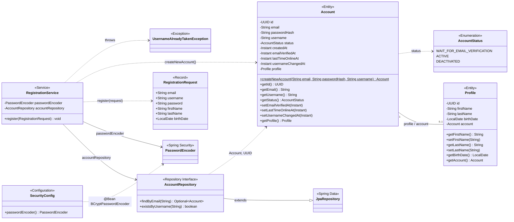

# Alma Matcher — Class Map

Scope: everything under `src/main/java/com/almamatcher` as of 2026-08-09 — 9 source classes across 6 packages, covering the registration flow only (no web/controller layer yet).

## Legend

| Stereotype | Meaning |
|---|---|
| `<<Entity>>` | JPA-mapped class, persisted via Hibernate (`Account`, `Profile`) |
| `<<Enumeration>>` | Fixed value set (`AccountStatus`) |
| `<<Record>>` | Immutable DTO used only in-memory (`RegistrationRequest`) |
| `<<Repository Interface>>` | Spring Data interface, no implementation written by hand |
| `<<Service>>` | `@Service` business-logic component |
| `<<Configuration>>` | `@Configuration` class providing beans |
| `<<Exception>>` | Checked exception |
| `<<Spring Security>>` / `<<Spring Data>>` | Framework types outside this codebase, shown for context |

## Field notes

- **`RegistrationService.register(...)`** is likely a typo for `register` — worth renaming before a controller starts calling it.
- **No web layer yet.** `RegistrationService` currently has no caller anywhere in `src/` — registration is only reachable directly (e.g. from a test).
- **`UsernameAlreadyTakenException`** has no constructor or message, so a caller catching it learns nothing about which username collided.
- **`Profile.birthDate`** is validated with `@Past` only — there's no minimum-age check, so a birth date of yesterday currently passes validation.
- `RegistrationService.java` ends with a self-directed comment asking how `JpaRepository<T, ID>` generics resolve for `AccountRepository extends JpaRepository<Account, UUID>` — happy to walk through that if useful (short answer: `T` = the entity managed, `ID` = the type of its `@Id` field, so `Account` is the entity and `UUID` is `Account.id`'s type).
