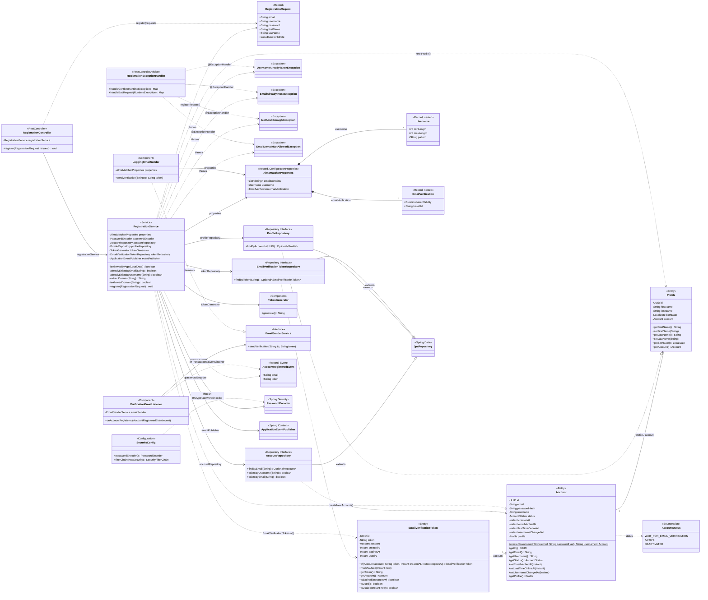

# Alma Matcher — Class Map

Scope: everything under `src/main/java/com/almamatcher` as of 2026-08-15 — 24 source classes across 9 packages, covering the registration flow end to end (controller → service → repository → entity) plus the email-verification-token issuance flow (token creation + `AccountRegisteredEvent` + listener that logs the link). No verify/confirm endpoint yet.

## Legend

| Stereotype | Meaning |
|---|---|
| `<<Entity>>` | JPA-mapped class, persisted via Hibernate (`Account`, `Profile`, `EmailVerificationToken`) |
| `<<Enumeration>>` | Fixed value set (`AccountStatus`) |
| `<<Record>>` | Immutable DTO used only in-memory (`RegistrationRequest`, `AlmaMatcherProperties`, `Username`, `EmailVerification`) |
| `<<Record, Event>>` | Immutable Spring application event payload (`AccountRegisteredEvent`) |
| `<<Repository Interface>>` | Spring Data interface, no implementation written by hand |
| `<<Service>>` | `@Service` business-logic component |
| `<<Component>>` | `@Component` bean that isn't a `@Service`/`@Repository`/controller (`TokenGenerator`, `LoggingEmailSender`, `VerificationEmailListener`) |
| `<<Interface>>` | Plain Java interface, no Spring stereotype of its own (`EmailSenderService`) |
| `<<RestController>>` / `<<RestControllerAdvice>>` | Web layer: HTTP endpoints and centralised exception translation |
| `<<Configuration>>` | `@Configuration` class providing beans |
| `<<Exception>>` | All four now unchecked (`extends RuntimeException`) |
| `<<Spring Security>>` / `<<Spring Data>>` / `<<Spring Context>>` | Framework types outside this codebase, shown for context |

`Account`, `Profile` and `EmailVerificationToken` also override or rely on identity conventions — `Account`/`Profile` override `equals`/`hashCode`/`toString` (identity on `email` and `account` respectively); `EmailVerificationToken` has none of the three, omitted from the diagram as boilerplate.

## Field notes

- **Web layer now exists.** `RegistrationController` (`POST /api/auth/register`, 201) is the only caller of `RegistrationService.register(...)`. `RegistrationExceptionHandler` (`@RestControllerAdvice`) turns the four registration exceptions into 409 (duplicate email/username) or 400 (age, domain) JSON bodies — nothing surfaces as a raw 500 anymore.
- **Email verification token issuance is wired, confirmation isn't.** `register(...)` creates the `Account` and `Profile`, generates a token via `TokenGenerator` (32 random bytes, URL-safe Base64), persists an `EmailVerificationToken` with `createdAt`/`expiresAt` computed from `AlmaMatcherProperties.emailVerification().tokenValidity()`, and publishes `AccountRegisteredEvent`. `VerificationEmailListener` picks it up with `@TransactionalEventListener(phase = AFTER_COMMIT)` — the email only "sends" after the DB transaction commits, so a rolled-back registration never notifies anyone. There is still no `GET /api/auth/verify` endpoint, so `EmailVerificationTokenRepository.findByToken(...)` and `EmailVerificationToken.isUsable(...)/markAsUsed(...)` have no caller yet.
- **`EmailSenderService` has one implementation.** `LoggingEmailSender` just logs the verification link (`{baseUrl}/api/auth/verify?token=...`) via SLF4J — no real email provider is wired in yet.
- `AlmaMatcherProperties.Username` validates `minLength`/`maxLength`/`pattern`, but nothing reads those fields — `RegistrationRequest.username` still hardcodes its own `@Size(min = 3, max = 20)` and regex independently.
