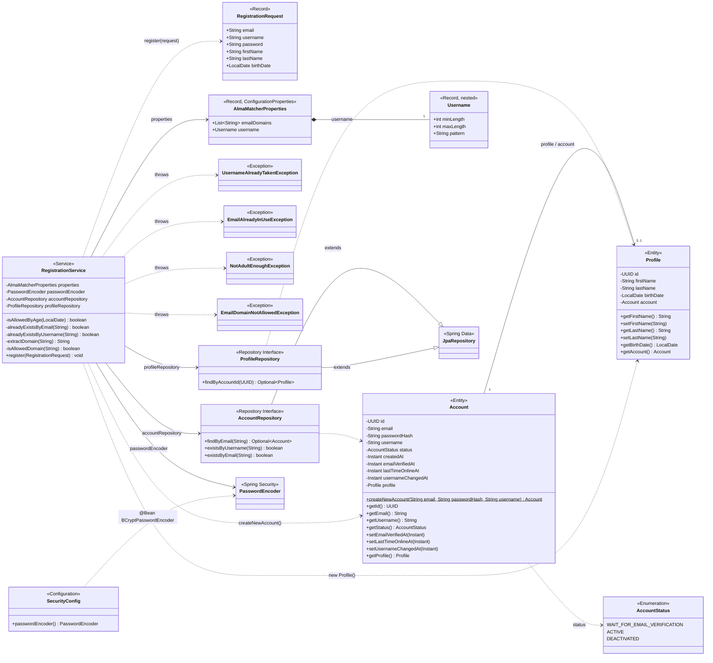

# Alma Matcher — Class Map

Scope: everything under `src/main/java/com/almamatcher` as of 2026-08-09 — 13 source classes across 6 packages, covering the registration flow only (no web/controller layer yet).

## Legend

| Stereotype | Meaning |
|---|---|
| `<<Entity>>` | JPA-mapped class, persisted via Hibernate (`Account`, `Profile`) |
| `<<Enumeration>>` | Fixed value set (`AccountStatus`) |
| `<<Record>>` | Immutable DTO used only in-memory (`RegistrationRequest`, `AlmaMatcherProperties`, `Username`) |
| `<<Repository Interface>>` | Spring Data interface, no implementation written by hand |
| `<<Service>>` | `@Service` business-logic component |
| `<<Configuration>>` | `@Configuration` class providing beans |
| `<<Exception>>` | All four now unchecked (`extends RuntimeException`) |
| `<<Spring Security>>` / `<<Spring Data>>` | Framework types outside this codebase, shown for context |

`Account` and `Profile` also override `equals`/`hashCode`/`toString` (identity on `email` and `account` respectively) — omitted from the diagram as boilerplate.

## Field notes

- The four registration exceptions are unchecked now and `register()` no longer declares `throws` — nothing in the codebase catches them yet, so once a controller exists it'll need a shared handler (e.g. `@ControllerAdvice`) to turn them into HTTP responses.
- `AlmaMatcherProperties.Username` validates `minLength`/`maxLength`/`pattern`, but nothing reads those fields — `RegistrationRequest.username` still hardcodes its own `@Size(min = 3, max = 20)` and regex independently.
- Still no web layer — `RegistrationService.register(...)` has no caller anywhere in `src/`.
